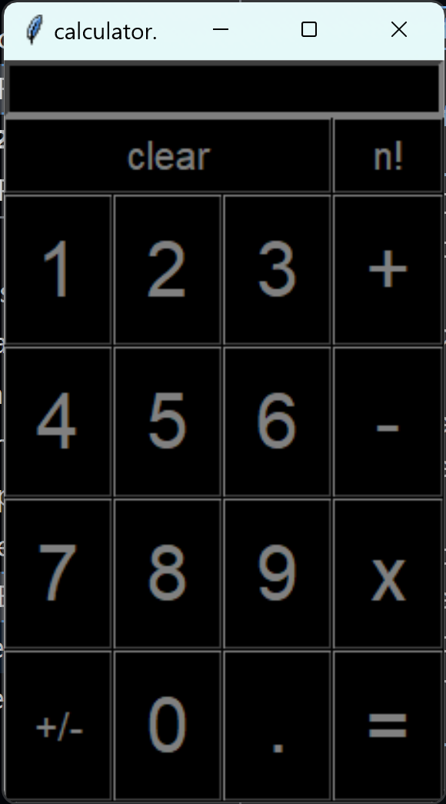
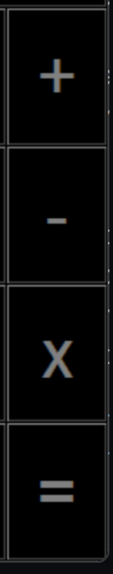

# Basic arithmetic calculator using Tkinter
#### 
### the url to my video: [URL](https://youtu.be/jmTFfaCKgfU)

### Why I decided to make it.
___
- I wanted to make something graphical and interactive
so the user can easily figure out what is happening and how it works.

- a calculator with basic arithmetic is simple for the user to understand, programmer or not.

- command-line programs are not that impressive when someone sees it, especially a non-programmer but with GUI (Graphical User Interface) it's much more impressive.
___

### How I learned tkinter.

- I mainly watched the "course" on tkinter by bro code on this [link](https://www.youtube.com/watch?v=TuLxsvK4svQ&ab_channel=BroCode)

- I did a lot of experimenting too.

- I also read how to use a frame from this geeks4geeks [page](https://www.geeksforgeeks.org/python-tkinter-frame-widget/)

- some people helped me in the CS50 discord and Python servers.

- I also used the CS50 duck debugger AI
___

### The libraries I used:

- I used the built-in tkinter library to create a GUI (Graphical User Interface) Application.

- I imported the "partial" function from the built-in "functools" library to not use lambda functions for passing in functions as arguments to the command= parameter in the button function from the tkinter library.

- I imported the "search" function from the built-in "re" library to create a regular expression which searches for the pattern __**"a string beginning with an integer or a float, negative or positive then an arithmetic operator and another number. This can be repeated as many times as the user needs to"**__

- and finally, I imported the factorial method from the math built-in library as "fac".

___
### I declared some global variables too.
- The first global variable I declared is the "window" Tk object also known as the "master" object which is the main window of the calculator.

- The second global variable I declared is the "num_pad" frame object which will contain the normal number buttons, the negative and positive toggle and the point button to make a float.

- The third global variable I declared is the "operator_pad" frame object which will contain the basic arithmetic operator buttons structured like this
#### 

- The fourth global variable I declared is the "mode" string object which can be in 2 states, "pos" for positive and "neg" for negative.

more on that down the file :)

- The fifth and final global variable I declared is called "input_box" which is an "Entry" object. it's used as an input box for receiving data. you can click it to type with the keyboard too.
___
### The custom functions I made.
- I made 3 custom functions excluding the main one.

- the first is the enter_number function which does the arithmetic calculations and adds stuff to the input box. more in detail down the file :).

- the second is the negative/positive toggle.
which toggles negativity for the first number.
more in detail down the file :).

- the third and final function I made is the factorial function which prints the factorial of an integer. more in detail down the file :).


___
### The main function
- The first thing the main function does is it makes a dictionary for the style of the buttons which I'll use as kwargs (keyword-arguments) for all the button initialisations.
```python
btn_style = {'bg': 'black', 'fg': 'grey', 'font': ('dahlia', 30)}
```

- next, there's a for loop to make and apply the numbers from 1 to 9 onto the num_pad frame.
```py
for i in range(9):
    row, col = i // 3, i % 3
    Button(num_pad,
            text=str(i + 1),
            command=partial(enter_number, i+1),
            **btn_style,
            ).grid(row=row, column=col)
```
as you can see, I used the btn_style as kwargs!!!

- next, I manually add the 0 below 8 like on a real calculator

- I added the negative toggle button next which is placed before the 0 button. I used the same dictionary for the kwargs but since the display text is +/- which has 3 characters instead of a single character, I changed the font to equal 15 so I used a dictionary comprehension for that. the command will call the "toggle_mode" function, more on that down the file. :)
```py
Button(num_pad,
        text="+/-",
        command=toggle_mode,
        font=('dahlia', 15),
        **{k: v for k, v in btn_style.items() if k != 'font'}
        ).grid(row=3, column=0, sticky="WESN")
```
- I, then, added the decimal point button.

- then I instantiated and applied the operators by using a for loop like this:

```py
for row, operator in enumerate(["+", "-", "x", "="]):
Button(operator_pad,
        text=operator,
        **btn_style,
        command=partial(enter_number, operator)
        ).grid(row=row, column=0, sticky="WESN")

```
- after that I made and applied the clear button to the window, pressing it clears the input box.

- then I made the "n!" button which means factorial.more on the function down the file :).

- then, towards the bottom of the file, we have this code:
```py
input_box.grid(row=0, column=0, columnspan=2, sticky="WESN")
num_pad.grid(row=2, column=0, sticky="WESN")
operator_pad.grid(row=2, column=1, sticky="WESN")

window.mainloop()
```
which assembles the widgets using the grid system
and "window.mainloop" is there to update the cursor location and the buttons I think.
___
### The enter_name function
```py
def enter_number(n):
    if input_box.get() == "ivalid equation.":
        input_box.delete(0, END)
    elif n == "=":
        equation = input_box.get()
        if search(r"^(\-?\d+(\.\d+)?[\+|\-|\*|\/])+\d+(\.\d+)?$", equation):
            input_box.delete(0, END)
            input_box.insert(0, eval(equation))
            return eval(equation)
        else:
            input_box.delete(0, END)
            input_box.insert(0, "ivalid equation.")
    else:
        if n == "x":
            input_box.insert(END, "*")
        else:
            input_box.insert(END, n)
```
- it takes in n as argument and it places n at the end of the input box until the equal button is pressed, when the equal button is pressed it checks if it's a valid equation or not because i'm using eval for the evaluation of the equations and using it can be harmful but in this case, it's not because i'm using a regular expression to check if it's a valid equation and if it is then replace everything in the input box with the solution else print "invalid equation" onto the input box.

- if n is x which means multiplication, it will add * instead.
___
### the toggle_mode function
```py
def toggle_mode():
    global mode
    if mode == "pos":
        input_box.insert(0, "-")
        mode = "neg"
    elif mode == "neg":
        input_box.delete(0)
        mode = "pos"
```
- so it changes the global variable "mode" to "neg" if it's "pos" and vice versa

- if mode is "neg" it will add a negative sign behind the first number.

- else if it's "pos", it will remove the sign.
___
### The factorial function
```py
def factorial():
    if not input_box.get().isdigit():
        if search(r"^(\-?\d+(\.\d+)?[\+|\-|\*|\/])+\d+(\.\d+)?$", input_box.get()):
            n = fac(int(eval(input_box.get())))
            input_box.delete(0, END)
            input_box.insert(0, n)
        else:
            input_box.delete(0, END)
            input_box.insert(0, "ivalid equation.")
    else:
        n = fac(int(input_box.get()))
        input_box.delete(0, END)
        input_box.insert(0, n)
```

if there's just a number in the input box, it replaces everything in the input box with the factorial of that number, however, if there's an equation like "1*3" and I press the "n!" button, it solves the equation and then prints the factorial of it so 1*3! = 6.
___
# That's all folks.
### all there's left is this
```py
if __name__ == __main__:
    main()
```
